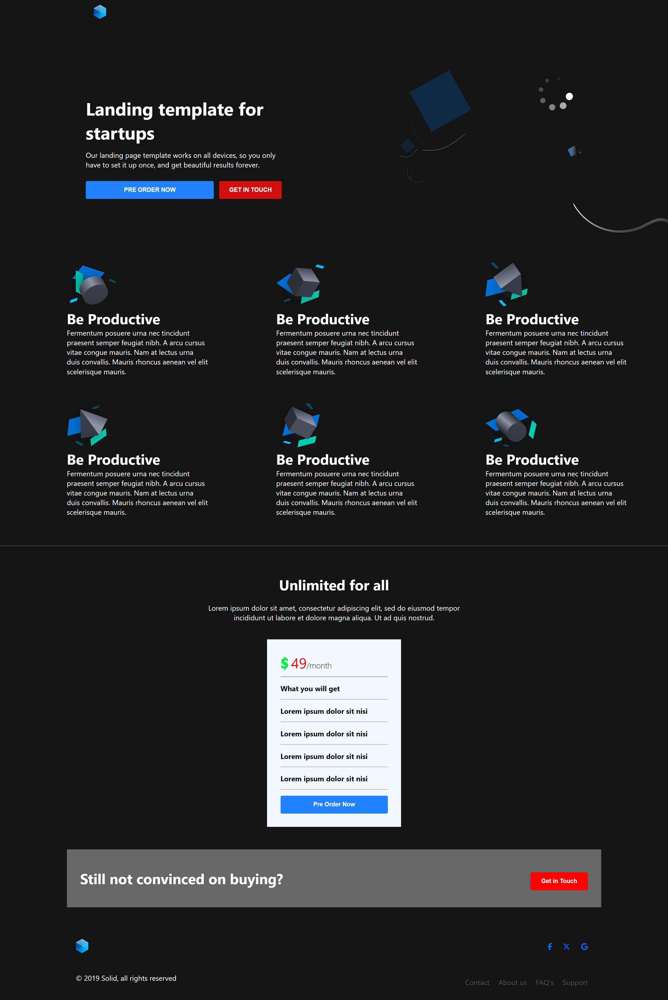

# 🚀 Solid Landing Page

A responsive, startup-focused landing page built with **HTML5** and **CSS3**. Designed to showcase a clean layout, flexible components, and call-to-actions that adapt well across all devices.

---

## 📸 Preview

 <!-- Replace with actual screenshot path if available -->

---

## 📁 Project Structure

solid-landing-page/
├── index.html # Main HTML file
├── style.css # CSS file with responsive design
├── src/
│ └── images/ # All image assets
└── README.md


---

## 🌟 Features

- ✅ Mobile-responsive layout using **Flexbox** and **Grid**
- ✅ Modular and readable HTML structure
- ✅ Organized, commented CSS for maintainability
- ✅ Reusable card components for pricing and features
- ✅ Integrated **Font Awesome 6** for social icons
- ✅ Clear and consistent typography and spacing

---

## 🛠️ Tech Used

- **HTML5**
- **CSS3**
- **Font Awesome 6** (via CDN)

---

## 🖥️ Live Demo

Coming soon... (You can host via GitHub Pages, Netlify, or Vercel)

---

## 📱 Responsive Design

- Mobile-first responsive styling included
- Layout adjusts beautifully on tablets, phones, and large screens
- Media queries ensure all components remain accessible and visually balanced

---

## 📦 How to Use

1. Clone this repo  
   ```bash
   git clone https://github.com/your-username/solid-landing-page.git
   cd solid-landing-page
